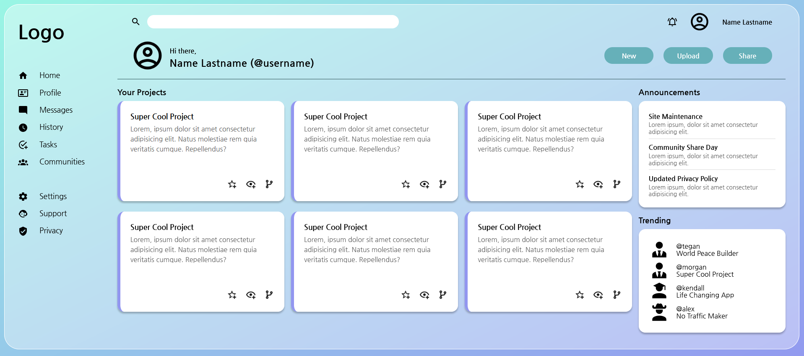

# The Odin Project - Intermediate HTML and CSS

## Admin Dashboard

A single page layout of a sample admin dashboard. 
[Live Version](https://jzaager.github.io/admin-dashboard/)

The main focus of this project was to practice using Grid to implement the layout. 

Inspiration for the design was a combination of The Odin Project's template and [Harmeet Matharoo](https://github.com/hmjatt).

Most effort was put into creating the grid layout on desktop, but I did include a few media queries for extra practice in creating responsive designs.

**In the future, I would tackle this project by initially arranging the mobile design, then adjusting for larger screen sizes.**